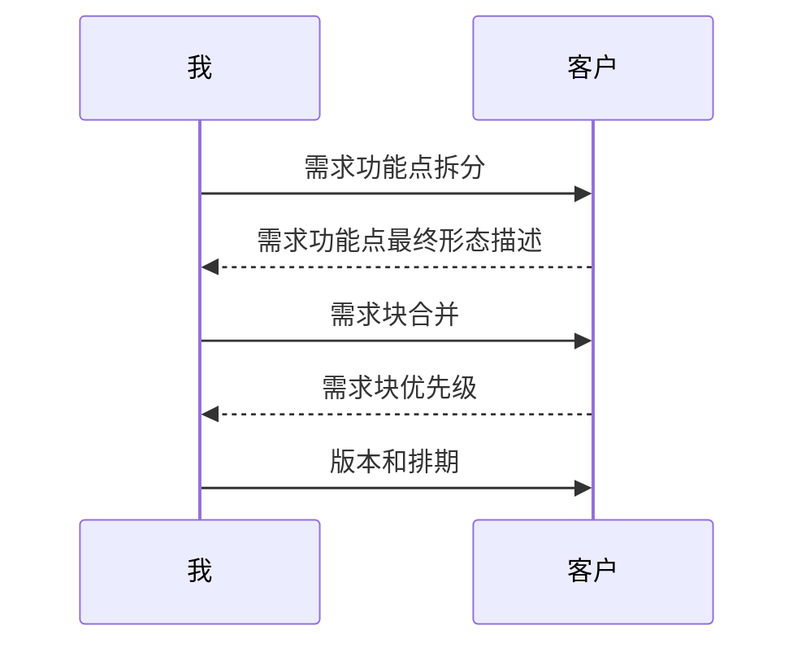

# JArgsParser需求分析

刚才我只是简单的介绍了一下我想要实现的`JArgsParser`，但你现在可能还不清楚我到底想要的是什么。

很多时候我们确实收到了一个“一句话需求”，也就是用户只简单给你描述了一下他想要的东西，但具体的范围他并没有一个直观的概念。这个时候就需要需求和开发人员上场了，他们会带着客户分析客户想要的产品是什么样子的，是否有其他条件，是否依赖外部环境等等，并引导客户完成原始需求报告。

那我简单地概括一下我的“原始需求”吧：

## 原始需求

提供一个C++11可以使用的参数加载库。要求具备以下功能：

1. 解析参数 
   1. 位置参数：程序后按照位置解析的参数
   2. 标志参数
   3. 值参数
   4. 动作参数
2. 提示帮助
3. 显示程序版本

要求这些功能具备以下特性：

**位置参数**

位置参数是紧跟在被调用程序名后的参数，要求能指定参数的位置，支持整数、小数和字符串的解析。当用户没有提供位置参数或者数量不足时要报错。

**标志参数**

标志参数是在被调用程序后用户指定的标志，支持短参数（`-a`）和长参数（`--aaa`），程序可以判断用户是否提供了指定标志参数。

**值参数**

标志参数是在被调用程序后用户指定的标志，支持短参数（`-a`）和长参数（`--aaa`），编码时可以指定是否强制要求，支持整数、小数和字符串的解析，额外支持以`,`分割的数组。

**动作参数**

动作参数是在被调用程序后用户指定的标志，支持短参数（`-a`）和长参数（`--aaa`），当用户提供了指定标志的动作参数，就立即执行任务。

**提示帮助**

希望能在用户输入错误的参数的时候或者主动请求的时候向用户提示错误，并显示帮助。

**显示程序版本**

希望能在用户输入`-v`的时候显示版本。

## 需求分析

我们在接到上面的原始需求时（虽然原始需求写的很不标准），需要开始对需求进行分析，一些同学可能比较喜欢开始动手画ER图了，但我认为这可能更近似于需求偏向设计阶段，此时的原始需求是不具备分析条件的，因为有些内容是未被定义发觉的。

就比如说，文中的

> 支持整数、小数和字符串

我们一般认为整数都是`2334`或者`-3123`之类的正负数，但`1E10`算不算？如果不输入整数的话应该会怎么样？这个时候我们就需要和客户一起梳理他的真实所想。我觉得这是一个非常重要的一部，否则，你可能得到的只是你自己认为的满意的作品，而不是客户心中认为的那个。在我实际开发过程中，也确实出现过类似的情况，我也逐步摸索，形成了一个我认为行之有效的办法：需求功能点法。

### 需求功能点法

需求功能点并不是我创建的，一些软件公司可能会针对需求规格说明书和设计文档对需求功能点进行统计，从而度量一个需求的规模，进而分配合理的资源进行预算分析。

我这里的需求功能点可能偏向经验一些，我通常会将一个需求中的功能拆分成一个个小的功能点，再与客户分析每个功能点的最终展现形式，然后我再对需求点合并成需求块，再让客户对每个需求块分配优先级。最终，我根据需求块的优先级安排迭代计划，并以此进行需求分析。

